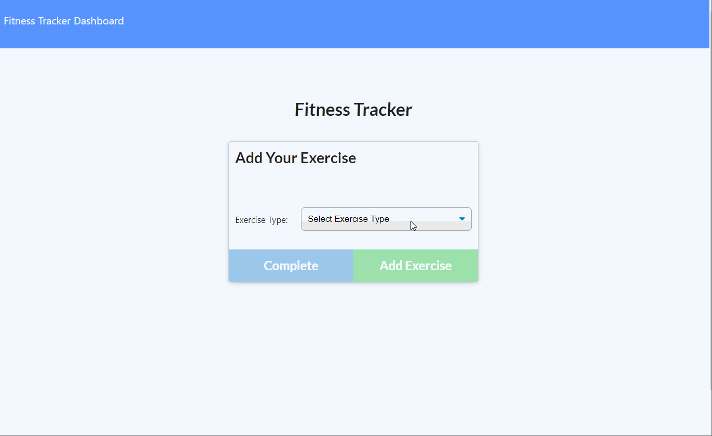

# Fitness Tracker

## Description
Keep track of each exercise in your workout by clicking the "New Workout" button at the start of each session. You enter the information into the form, and if you want to add another exercise to that workout session, choose "Add Exercise." When you have entered all the exercised from that session, choose "Complete" to send that whole workout to your stats page. However, you can add to your most recent workout by clicking "Continue Workout" from the home page. Click the "Dashboard" link at the top of the page to view your stats.

## Table of Contents
* [Deployed Link](#deployed-link)
* [Installation](#installation)
* [Usage](#usage)
* [License](#license)
* [Author](#author)
* [Questions](#questions)
* [Acknowledgements](#acknowledgements)

## Deployed Link
[Deployed on Heroku](https://intense-lake-55087.herokuapp.com/)

## Installation
If you wish to clone the code locally, you will need to run
`npm install` to install the dependecies listen in the package.json. 
Run the seeds file to populate the database with `npm run seed`

## Usage
Used the deployed site provided above.

## License

## Author
Haley Myers

## Questions
Please email [haleynmyers@gmail.com](mailto:haleynmyers@gmail.com)

## Acknowledgements
Puplic files and seeds.js provided by Trilogy

